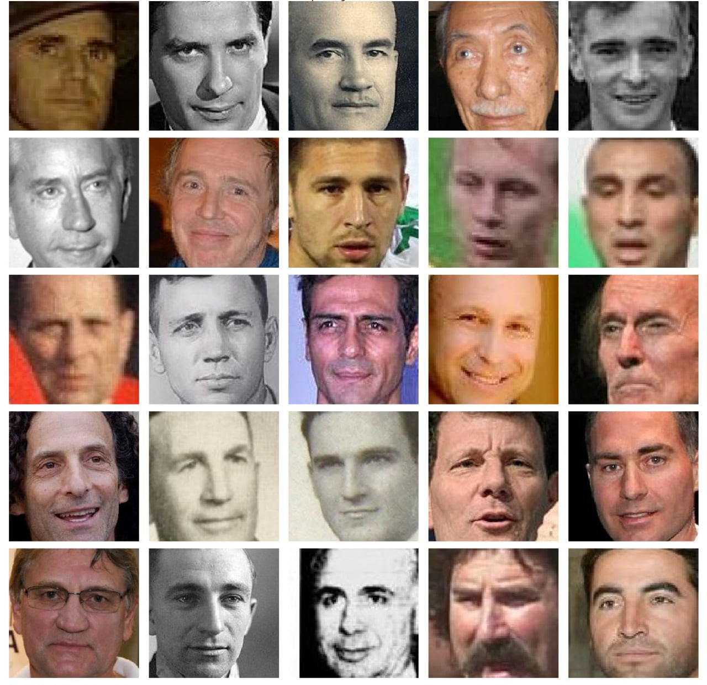
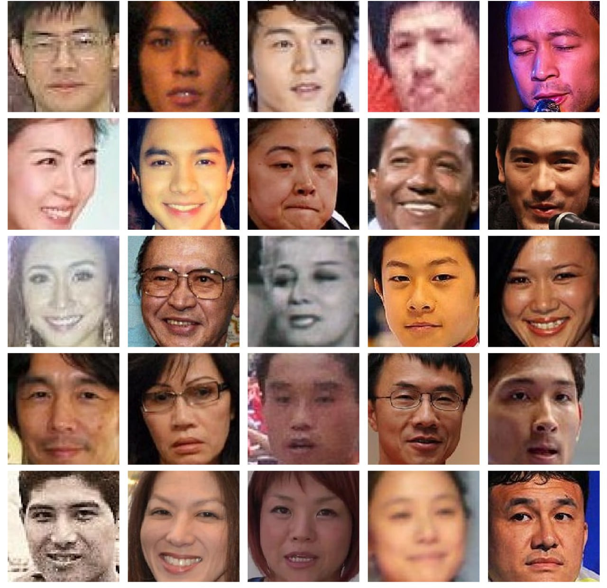
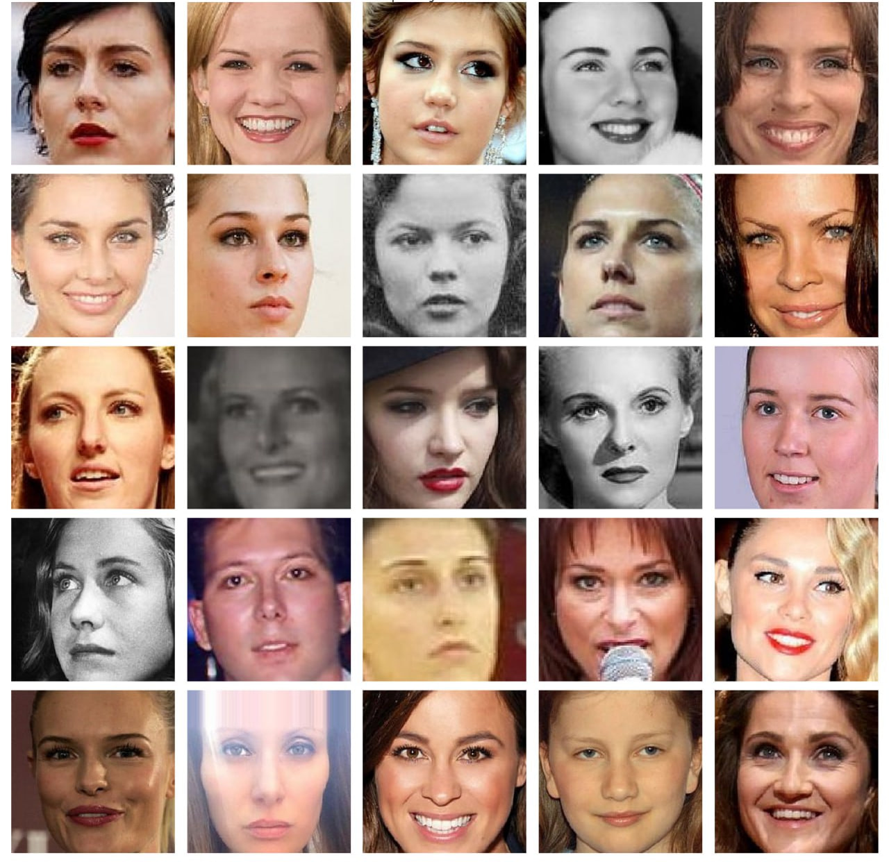
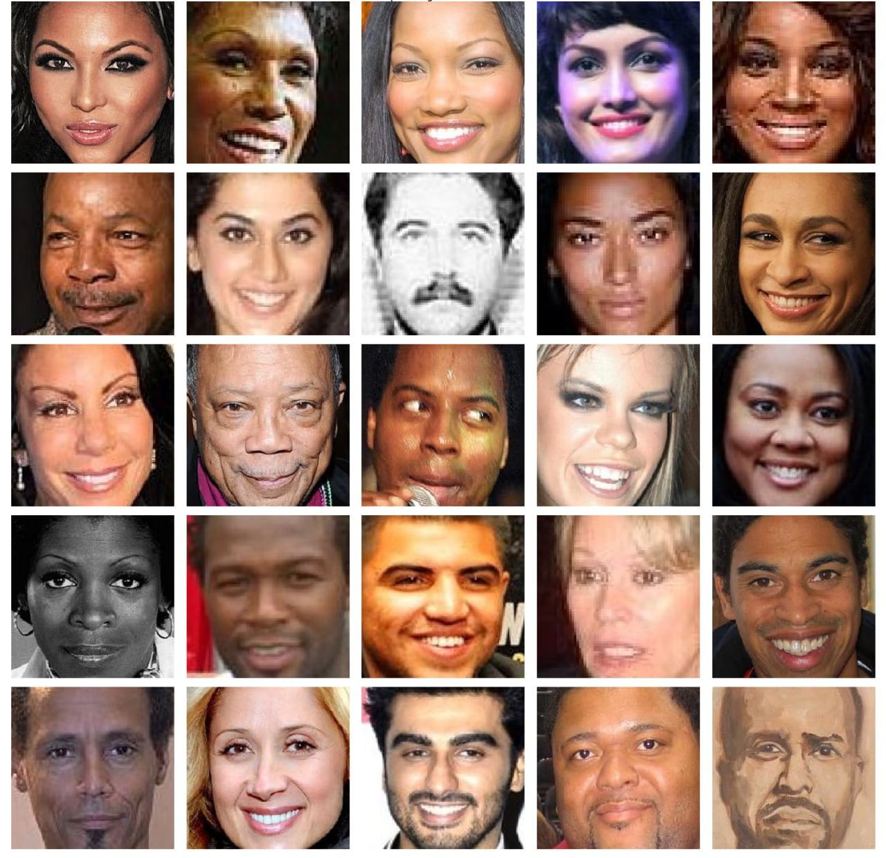
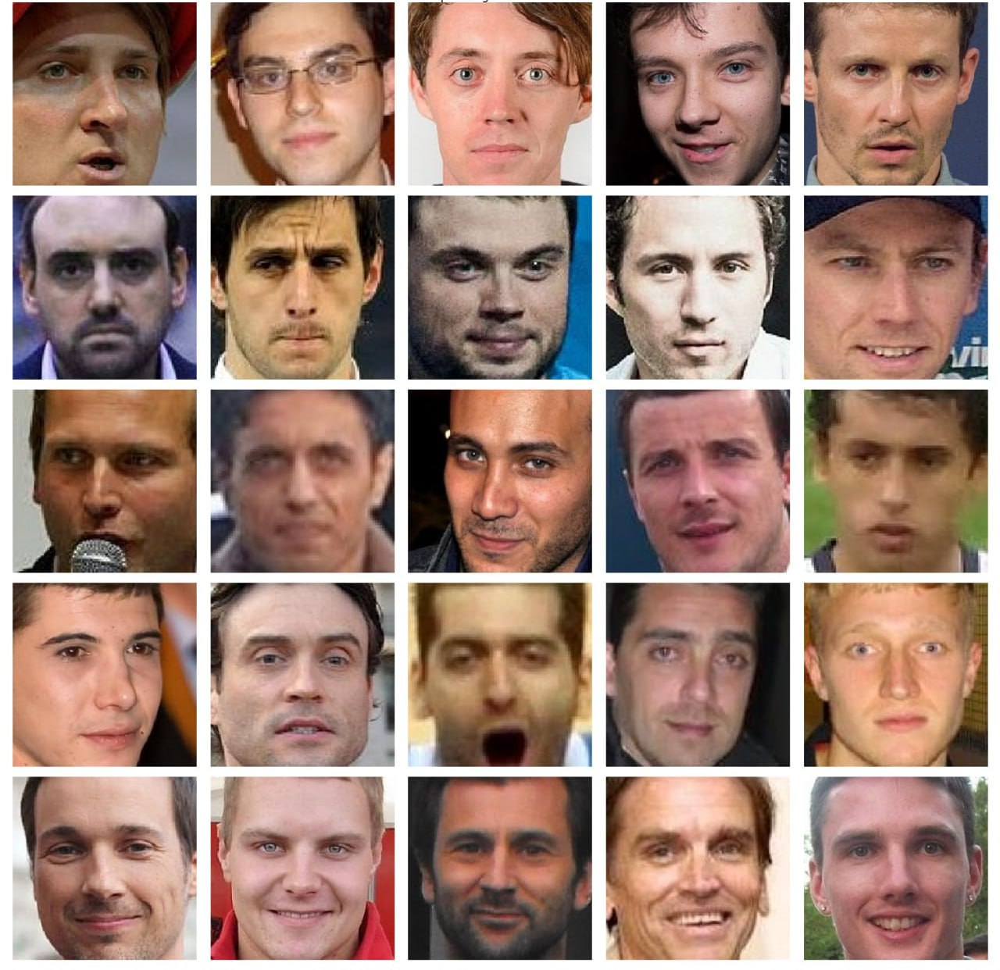
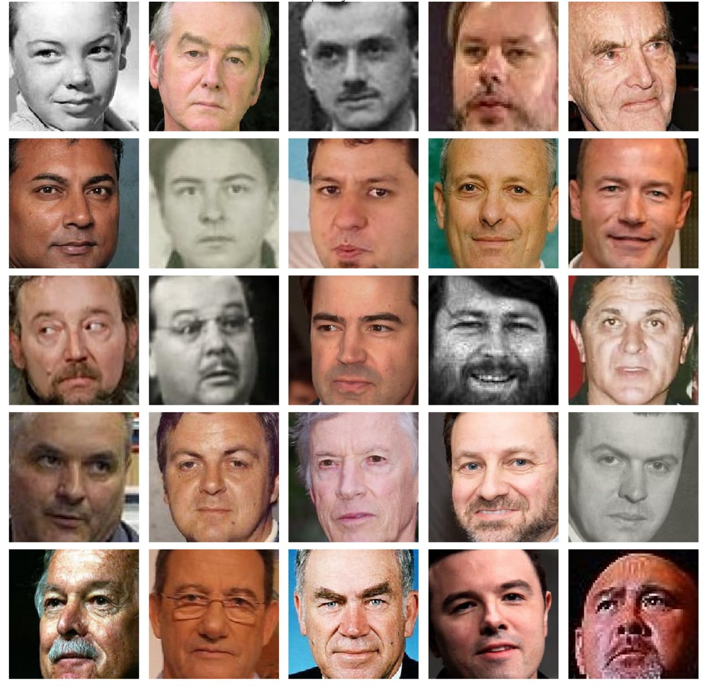

# INT20H Hackathon (Data Science)
Made by **XDBoobs team** for **INT20H** 

**Main task: face clustering and aggregating images within each cluster** 
Train dataset: [IMDB-WIKI dataset](https://data.vision.ee.ethz.ch/cvl/rrothe/imdb-wiki/)

## General pipeline overview

### Face detection
We use ready-made solution from OpenCV for face detection and cropping. We set `minNeighbors` parameter to 45 to reduce the number of false positive instances and get more accurate face pictures. As a result, we obtain ~8.4k images for training.

### Generating vector representations from cropped images
We use [VGGFace model](https://github.com/YaleDHLab/vggface) with ResNet50 backbone to generate 2048-dimensional image embeddings. This step is done to extract informative features before clustering the images.

### Clustering
Then we perform clustering procedure using KMeans algorithm. To determine the optimal number of clusters, we carefully analyze the output of the clustering algorithm. Below you can see the resulting clusters with a general description of each:  
**Cluster 0** 
 
**Cluster 1** 
 
**Cluster 2** 
 
**Cluster 3** 
 
**Cluster 4** 
 
**Cluster 5** 
 
**Cluster 6** 
 

### Aggregating images within each cluster
To perform image aggregation we fit Conditional VAE model. CVAE is used to obtain latent distribution from which we can sample zero vector dependent on given cluster label.  
**Cluster 0** 
**Cluster 1** 
**Cluster 2** 
**Cluster 3** 
**Cluster 4** 
**Cluster 5** 
**Cluster 6** 

